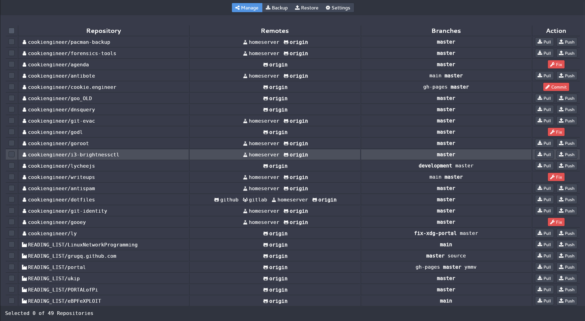

# git-evac

Git EVAC is my experimental repository management tool, because to me it is hard to keep track of
my over 300 local repositories on my development systems.

It's hard to keep track of what I changed in which repository and what I already synchronized/pushed
to which remote, so this tool tries to give me a graphical UI that is made for batch-tasks, where I
can start a backup procedure for all repositories and just leave the computer alone or do something
else in the meantime.


## Screenshot




## Opinions

- Least common denominator action precedes. [1]
- No rebases that lose reference to `master` branch.
- No shallow clones, use your gogs or gitea instance for that.
- Users or Organizations can be hosted on multiple remotes. [2]
- Convention for folder structure is `~/Software/<orga or user>/<repository>/.git`


[1] If one of the selected repositories requires a fix for a detached HEAD because of a merge conflict,
you have to do that one first. If you have an uncommited change, you have to commit. Only clean work
trees can be pushed and pulled to/from remotes.

[2] Remote names are e.g. github, gitlab, gogs, or gitea. API endpoints are currently unsupported, but
will be (hopefully) supported to get an overview of available repositories; so that cloning/replicating
them locally can be automated.


## Actions

This tool is very opinionated and enforces a triangular workflow, where work on downstream forks has
to be done in either feature-specific branches or on the master branch directly. It assumes that local
repositories are always in a clean state before push and pull actions, meaning that no uncommited
changes to the work tree are allowed.

All actions are batchable, meaning that they can be applied to multiple selected repositories in an
unattended manner once configured/setup in a preceding dialog.

- The `fix` action precedes all others, and is displayed for a `merge conflict`, `detached HEAD` or
  otherwise unmergeable changes where the `index` differs too much from `work tree`.

- The `commit` action is displayed when the `index` differs from `work tree` and uncommited local
  or remote changes exist.

- The `pull` action pulls changes from remotes, and assumes that the current branch is in a clean
  and merged state.

- The `push` action pushes changes to remotes, and assumes that the current branch is in a clean
  and merged state.

- The `backup` action exports a repository into a backup folder that will store the compressed `.tar.gz` file.

- The `restore` action imports a repository from a backup folder that stores the compressed `.tar.gz` file.


## Work-in-Progress

Currently, this tool is heavily experimental. Most things don't work yet, there's a separate
[TODO.md](/TODO.md) that tries to structure my cluttered ideas for this.


## Building

Use the [git-evac](/source/cmds/git-evac) for production usage, it will use the embedded
[public.FS](/source/public/FS.go).

```bash
# Install go compiler/language
sudo pacman -S go;

# look ma, no sudo!
bash build.sh;

# starts a local server and opens a webview window
./build/linux/git-evac_linux_amd64;
```


## Development Workflow (with Hot Reload)

Use the [git-evac-debug](/source/cmds/git-evac-debug) for development purposes, it will use the
local filesystem and doesn't use the embedded [public.FS](/source/public/FS.go). It will automatically
rebuild the `wasm_exec.js` and `main.wasm` files in the [public](/source/public) folder.

```bash
cd ./source;

# starts a local development server on http://localhost:1234
go run cmds/git-evac-debug/main.go;
```

You can leave the development server running, and just reload/refresh the page to regenerate
the new WebASM binary automatically. Build errors will be shown in the console.

- Make sure the Browser Cache is disabled in the `Dev Tools > Network` tab.
- For detailed errors, try to rebuild the `main.wasm` with the [build.sh](/build.sh) script.


## License

This project is licensed under the [GNU AGPL 3.0](./AGPL-3.0.md) license.


## Sponsorship

If you like the work that I do and want me to continue working on things
like this; it would be awesome if you would sponsor this project:

https://github.com/sponsors/cookiengineer

