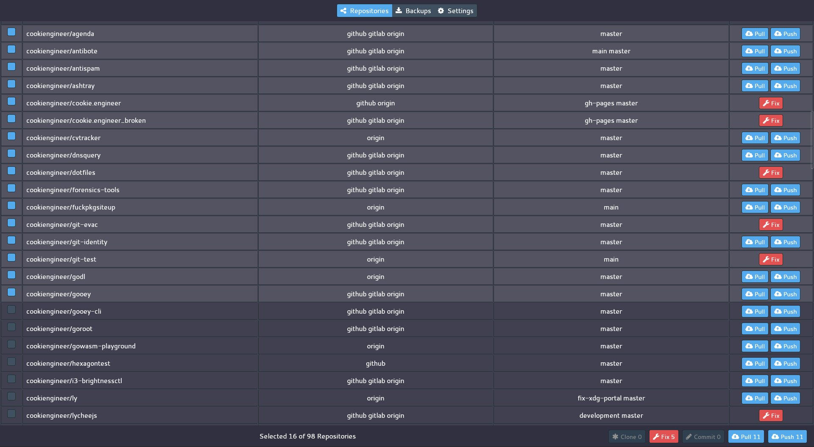

# git-evac

Git EVAC (`/ɡɪt ˈɛvæk/`) is my experimental repository management tool. Its purpose is to fix,
pull, push, and manage all local repositories as automated as possible, without having to intervene
actively.

But, as git isn't failsafe, the restrictions fit my workflow. If you have a different workflow,
you have to either use my strictly triangular workflow with feature branches or look for a different
tool.


## Screenshot




## Opinions

- Least common denominator action precedes. [1]
- No rebases that lose reference to `master` branch.
- No shallow clones, use your gogs or gitea instance for that.
- Owners (users or organizations) can be hosted on multiple remotes. [2]
- All remotes and services must use the same repository names.
- All remotes must use the same branch names.
- `origin` remote must be the source of truth for merge conflicts. [3]
- Folder structure is `~/Software/{{owner}}/{{repo}}/.git`.
- Backup structure is `~/Backup/{{owner}}/{{repo}}.tar.gz`.

[1] If one of the selected repositories requires a fix for a detached HEAD because
of a merge conflict, you have to do that action first. If you have an uncommited
change, you have to commit first. Only clean work trees can be pushed and pulled
to/from remotes.

[2] Remote name conventions are `origin`, `github`, `gitlab`, `gogs`, or `gitea`.
The services API endpoints are stored per-owner in the settings and need need
to be identically named as their equivalent remote name.

[3] If there is no `origin` remote, you have to fix that.


## Actions

This tool is very opinionated and enforces a triangular workflow, where work on downstream forks has
to be done in either feature-specific branches or on the master branch directly. Git Evac assumes that
local repositories are always in a clean state before `push` and `pull` actions, meaning that no
uncommited changes to the work tree are allowed.

All actions are batchable, meaning that they can be applied to multiple selected repositories in a
queued manner once confirmed in a preceding overview dialog.

- The [Clone](/source/actions/Clone.go) action precedes all other actions. It
  is displayed when the repository was discovered online on `github`, `gitlab`,
  `gitea` or `gogs` services, and wasn't cloned locally (yet).

- The [Fix](/source/actions/Fix.go) action is displayed for a `merge conflict`,
  `detached HEAD` or otherwise unmergeable changes where the `index` differs
  too much from the `work tree`.

- The [Commit](/source/actions/Commit.go) action is displayed when the `index`
  differs from `work tree` and uncommited local changes exist.

- The [Pull](/source/actions/Pull.go) action pulls changes from all remotes,
  and assumes that the current branch is in a clean state. After the initial
  `git fetch` it will attempt to `git diff` against `origin/<branch>` to
  figure out whether a `git merge origin/<branch>` is possible.

- The [Push](/source/actions/Push.go) action pushes changes to all remotes,
  and assumes that the current branch is in a clean and merged state.

- The [Backup](/source/actions/Backup.go) action exports a repository into
  a backup folder that will store the compressed file under the file path
  `~/Backup/{{owner}}/{{repo}}.tar.gz`.

- The [Restore](/source/actions/Restore.go) action imports a repository from a backup folder's compressed
  file into the `~/Software/<organization or user>/<repository>` repository. If that repository already exists,
  it is renamed to `<repository>.bak` to prevent loss of changes.


## Work-in-Progress

Currently, this tool is highly experimental. There's a separate [TODO.md](/docs/TODO.md)
document that structures my cluttered ideas for this project.

As Go doesn't have a reasonable UI framework, I created the [Gooey Framework](https://github.com/cookiengineer/gooey)
so that I can write all App related code in Go, too.

- The [ARCHITECTURE.md](/docs/ARCHITECTURE.md) documents the structure of the App and its locally exposed Web APIs.
- The [TODO.md](/docs/TODO.md) documents what is planned as features and not implemented yet.


## Building

Build the [git-evac](/source/cmds/git-evac) command for production usage, it will use the embedded
[public.FS](/source/public/FS.go).

```bash
# Install go compiler/language
sudo pacman -S go;

# look ma, no sudo!
bash build.sh;

# starts a local server and opens a webview window
./build/linux/git-evac_linux_amd64;
```


## Development Workflow (with Hot Reload)

Run the [git-evac-debug](/source/cmds/git-evac-debug) command for development purposes, it uses the
local filesystem and doesn't use the embedded [public.FS](/source/public/FS.go). It automatically
rebuilds the `wasm_exec.js` and `main.wasm` files in the [public](/source/public) folder on the fly
(also known as hot reload).

```bash
cd ./source;

# starts a local development server on http://localhost:3000
go run cmds/git-evac-debug/main.go;
```

You can leave the development server running, and just reload/refresh the page to regenerate
the new WebASM binary automatically. Build errors will be shown in the console.

- Make sure the Browser Cache is disabled in the `Dev Tools > Network` tab.
- For detailed errors, try to rebuild the `main.wasm` with the [build.sh](/build.sh) script.


## License

This project is licensed under the [GNU AGPL 3.0](./AGPL-3.0.md) license.


## Sponsorship

If you like the work that I do and want me to continue working on things
like this; it would be awesome if you would sponsor this project:

https://github.com/sponsors/cookiengineer

